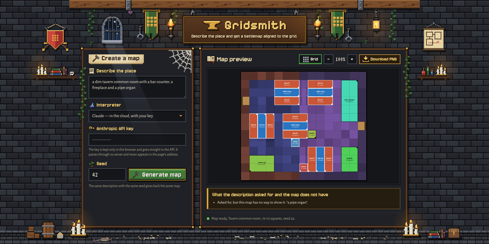
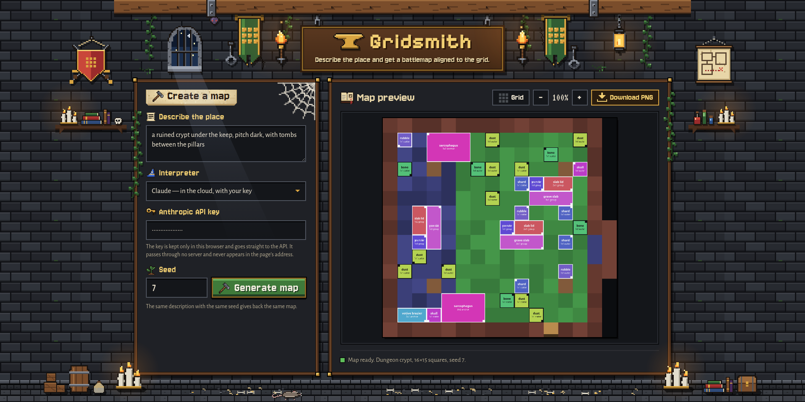
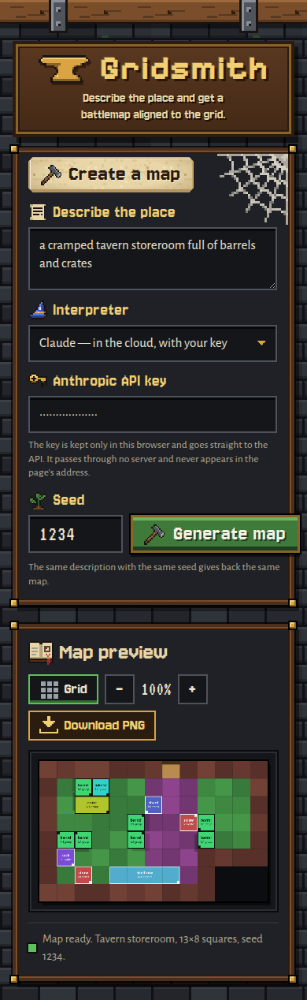
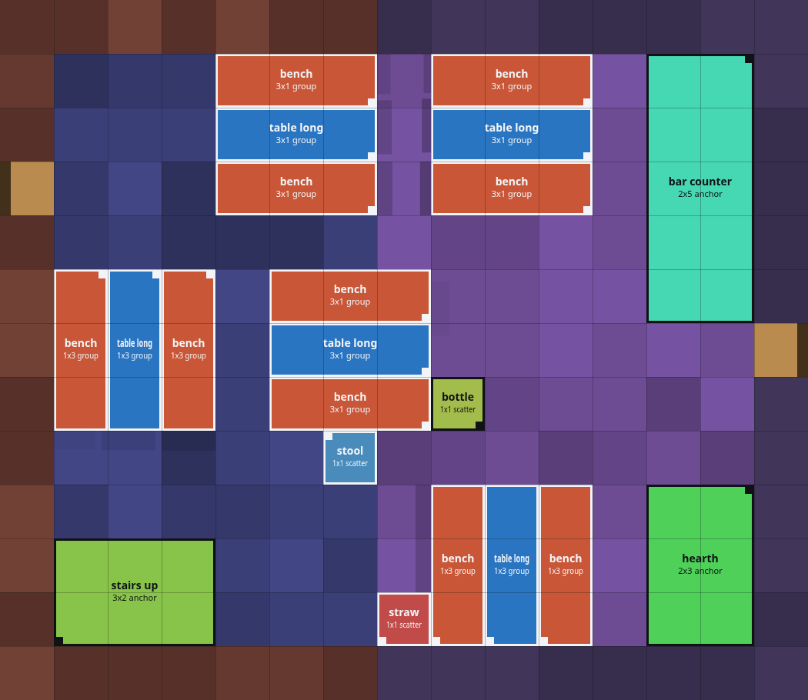
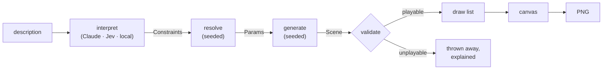

# Gridsmith

Describe a place in plain language and get a top-down battlemap back, aligned to the grid, ready to drop into a virtual tabletop.

**Live demo:** [gridsmith-mu.vercel.app](https://gridsmith-mu.vercel.app/)



<sub>A real map from the generator; the interpreter's answer was stubbed for the screenshot. See [Screenshots](#screenshots).</sub>

You write something like *"a dim tavern common room with a bar counter, a fireplace and a pipe organ"*. A language model reads that into a small, closed set of constraints, and a seeded generator builds the room: walls, floor, doors and furniture, all on whole squares. The page shows you the map and lets you download it as a PNG at 70 px per square, which is Roll20's default grid.

The organ is in that sentence on purpose. **Gridsmith has no organ:** it is not in the vocabulary, so it is not drawn. With the Claude engine, the page is meant to say so under the map instead of leaving it out quietly; the other two engines don't notice an object like that (see [The three interpreters](#the-three-interpreters)). Everything it *can* draw is listed under [What it does](#what-it-does).

Once a description has been read, the seed decides everything else: the same reading with the same seed always builds the same map.

---

## Contents

- [What it does](#what-it-does)
- [What it doesn't do yet](#what-it-doesnt-do-yet)
- [Screenshots](#screenshots)
- [The three interpreters](#the-three-interpreters)
- [Architecture](#architecture)
- [Running it locally](#running-it-locally)
- [Deploying](#deploying)
- [Keys, privacy and analytics](#keys-privacy-and-analytics)
- [Licence](#licence)

---

## What it does

- **Plain-language input.** A description goes in, and a map comes out.
- **A closed vocabulary.** There are 10 buildings and 23 rooms:

  | Building | Rooms |
  | --- | --- |
  | Tavern | common room · guest room · storeroom |
  | Dungeon | guard hall · cell · armoury · crypt |
  | Smithy | forge · shopfront |
  | Temple | nave · sacristy |
  | Library | reading room · archive |
  | Wizard's tower | laboratory · observatory |
  | Mine | gallery · winch house |
  | Ship | cargo hold · captain's cabin |
  | Apothecary | distillery · herb room |
  | Thieves' den | fence room · escape tunnel |

  On top of that, the description controls ten features (bar, hearth, stairs, pillars, alcove, shelving, bunks, bed, weapons, tomb), plus the light (dark, dim, bright), the condition (from tidy to ruined), how much clutter covers the floor and how furnished the room is.
- **Honest about what it left out.** What the map doesn't have is listed under it in a sentence. That covers a word the generator doesn't know, a feature that doesn't belong in this kind of room, a feature with no floor space left for it, and a feature that was both asked for and refused. With Claude, a request outside the vocabulary (the organ) is meant to be listed too. Jev only notices when the place itself is outside the catalogue (a stable, a market), not an object inside a place it knows, and the local engine notices neither. With those two, an organ is left out without a word (see [What it doesn't do yet](#what-it-doesnt-do-yet)).
- **Playable by construction.** Every map is checked before it is shown. There must be at least one door, no door blocked by furniture, no floor you can't reach, and room to walk between the furniture. A map that fails is thrown away rather than drawn.
- **Deterministic.** Everything after interpretation is a pure function of the seed. A blank seed gets a random one, which is written back into the field so the map can be found again.
- **Grid on or off.** The grid toggle redraws the map without generating it again. The PNG is exactly what is on screen, so the download follows the toggle.
- **No backend of its own.** Generating, drawing and encoding happen in the browser. Interpreting happens wherever the chosen engine runs: Claude and Jev on their providers' servers, called from the page with your own key, and the local model in the browser itself. The only server code in this project is a small relay that one of the three engines needs (see below).

## What it doesn't do yet

These are known gaps, not bugs.

- **No real art on the map.** Furniture is drawn as labelled, colour-coded markers (see the screenshots). The engine is built against an asset contract (`src/assets/contract.ts`), and the art pack it was designed around does not allow its art to be redistributed. So the repository ships a marker library generated by code (`src/assets/placeholder.ts`), and **the page has no way yet to load a real library**. The pixel art around the page is decoration and has nothing to do with the map.
- **One room per map.** There are no multi-room levels, corridors or connections between maps. A room is at most 20 × 20 squares.
- **Nothing outside the vocabulary.** A request for anything outside the vocabulary (a "pipe organ", a "second floor") is reported in a notice and not drawn. You can't ask for a specific piece of furniture beyond the ten features; the rest comes from the room's own profile.
- **Only Claude reports objects it can't draw.** Ask Jev or the local model for an organ in a tavern and you get a tavern, with no notice that the organ was left out. Jev's one out-of-vocabulary question is about the kind of building, not about what is inside it.
- **"No X" only reaches the fixtures.** Saying there are no stairs keeps the staircase out. Exclusions apply to the featured fixtures (bar, hearth, stairs…), but not yet to the loose items on the floor or to the table-and-chair groups.
- **The interpreters were tuned on Portuguese.** The interface is in English, but the vocabulary each engine was calibrated and measured against is Portuguese: Jev's criteria, the local model's labels and the synonyms that steer it. English descriptions have not been measured against any engine. Claude is the most likely to cope, and the local engine is the least, since its synonym steering only recognises Portuguese words.
- **The local engine understands less.** It can't report what a description asked for and the map lacks, and it can't read refusals ("no stairs"). It downloads about 310 MB the first time, and it has never been timed in a browser.
- **The same seed is not always the same reading.** The seed fixes everything *after* interpretation. A cloud model may read the same sentence slightly differently on two calls, because nothing is cached and the sampling isn't pinned.
- **The export is only a flat PNG.** There is no tabletop metadata: no walls, doors or light sources for Foundry or Universal VTT, and no dynamic lighting. The light exists only as shading baked into the picture.
- **No editing.** You can't move a piece or redraw a wall after generating. You regenerate instead.
- **Keys aren't remembered for Jev.** A TypeSafe key has to be pasted on every visit, and the Anthropic key shares a single browser storage slot.
- **No browser test suite.** The tests run in Node against a hand-written stand-in for the DOM. The real page has only been checked by hand and with headless screenshots.

## Screenshots

The maps in these screenshots are real output of the generator and the renderer. The interpreter's side was stubbed: the page's call to the Anthropic API was answered with a fixed set of constraints, including the organ notice above, so that the pictures could be taken without a key. A live call produces the same kind of page, but what it reads into a sentence may differ.

| A crypt, grid switched off | On a phone |
| --- | --- |
|  |  |

And this is the downloaded file itself, 15 × 13 squares at 70 px per square:



## The three interpreters

The interpreter is the only part that needs a model. Each of the three costs something different, so the page lets you choose.

| | Claude | Jev (TypeSafe) | Local model |
| --- | --- | --- | --- |
| Runs | Anthropic's API (`claude-opus-5`) | TypeSafe's System One API | in your browser (WebAssembly) |
| Needs | your Anthropic API key | your TypeSafe API key | about 310 MB, downloaded once |
| Route | straight from the browser | through `/api/jev`, a relay on this site | nowhere; works offline afterwards |
| Reports an object outside the vocabulary (an organ) | yes, by design¹ | no | no |
| Reports a place outside the catalogue (a stable) | yes, by design¹ | yes | no |
| Understands refusals ("no stairs") | yes | yes | no |

¹ Claude is asked to list everything the vocabulary can't carry (`unresolved` in `src/interpreter/schema.ts`). That is the instruction; whether a given call honours it is up to the model, and the organ notice in the screenshots was stubbed rather than produced by a live call.

Why does Jev need a relay? TypeSafe's API answers a browser without an `access-control-allow-origin` header, on both the request and the preflight, so a page can't read the answer. Anthropic publishes an opt-in header for direct browser access, and TypeSafe has no equivalent. `api/jev.ts` stands in the middle and does nothing else:

- it forwards the body as it arrived;
- it turns the key header into a bearer token;
- it gives up after 30 seconds;
- it never logs anything.

The local engine is `Horizon-Labs/multilingual-zeroshot-small` (Apache-2.0), run with `@huggingface/transformers`: a zero-shot classifier that scores the description against a short label for every option of every constraint, and keeps the winners.

## Architecture



Every stage hands a value to the next over the types in `src/core/types.ts`, and every stage after `interpret`, which is the only one that talks to a network, is a pure function of its input and the seed. Shortfalls travel as **codes** (`feature_not_in_place`, `unsupported_request`…) rather than sentences. Only the interface turns a code into words.

1. **Interpret** turns text into `Constraints`: the place, the light, the condition, clutter and furnishing (two separate dials), and the requested, excluded and unresolved features. The vocabulary is closed, and validated with `zod`.
2. **Resolve** turns `Constraints` into `Params`. It settles the footprint and the door count from the seed, and it records conflicts, such as a feature that doesn't belong in the room or was asked for and refused.
3. **Generate** produces a `Scene` in four stages. The first three draw from one seeded generator; the lights are derived from what was placed.
   - **floorplan** (`floorplan.ts`, `shapes.ts`): a rectangle, an L, a T or a room with an alcove, plus doors and pillars;
   - **materials** (`materials.ts`): floor and wall zones;
   - **props** (`props.ts`): wall anchors first, then furniture groups, then loose scatter;
   - **lights** (`lights.ts`).
4. **Validate** (`validate.ts`) checks for a door, unblocked doors, reachable floor and room to walk.
5. **Render** builds a plain list of draw commands (`drawlist.ts`), so what is drawn can be tested without a browser. It then executes the list onto a canvas and encodes a PNG.

Every place lives in one registry, `src/generator/profiles.ts`. A kind of room (a hall, a storeroom, a crypt…) declares its geometry once, and each building that has it fills it in: its materials, its furniture, and the words it is spoken about in. The exact `Record` types derived from that registry make a forgotten table a compile error, not a missing map.

| Path | What lives there |
| --- | --- |
| `src/core/` | the frozen contracts, the grid helpers, the seeded PRNG |
| `src/interpreter/` | the three engines, the shared vocabulary and schema, `resolve` |
| `src/generator/` | the registry, the four stages, validation |
| `src/renderer/` | the draw list, geometry, shadows, the canvas and PNG |
| `src/assets/` | the asset contract and the marker library |
| `src/ui/` | the page: wording (`messages.ts`), the page itself (`mount.ts`), the stylesheet, the pixel art drawn in code (`art.ts`) and the room it is set in (`scene.ts`) |
| `api/jev.ts` | the relay, the only server code |
| `test/` | the relay's tests; everything else is tested beside its source |

The interface is built by hand with DOM calls, with no framework. Its pixel art (torches, banners, the rat on the floor) is drawn pixel by pixel in TypeScript rather than shipped as image files. The fonts are self-hosted under the SIL Open Font License.

## Running it locally

You need Node `^20.19` or `>=22.12`.

```sh
git clone https://github.com/vinicius-francozo/gridsmith.git
cd gridsmith
npm ci
npm run dev        # http://localhost:5173
```

`npm run dev` serves the `/api/jev` relay as well, using the same handler that ships, so all three engines work locally. Paste an Anthropic or a TypeSafe key into the page, or pick the local model and wait for the first download.

| Command | What it does |
| --- | --- |
| `npm test` | runs the Vitest suite (about 1,200 tests, in Node) |
| `npm run typecheck` | runs `tsc --noEmit` over `src/`, `api/`, `test/` and the Vite config |
| `npm run build` | builds the static site into `dist/` |

## Deploying

The project is set up for Vercel (`vercel.json`). Import the repository and deploy; nothing needs to be configured:

- the site is the static `dist/`;
- `api/jev.ts` becomes a serverless function;
- no environment variables are needed, because every key comes from the person using the page.

After a deploy, `OPTIONS /api/jev` should answer 204 with `access-control-allow-origin: *`, and a `POST` without a key should answer 401 with a JSON error. Then generate a map with Jev on the real domain.

## Keys, privacy and analytics

- **The Anthropic key** is stored in this browser's `localStorage` and sent straight to Anthropic. It never touches a server of this project.
- **The TypeSafe key** is kept in memory for the visit only and travels through `/api/jev`, which forwards it and keeps and logs nothing. The tests spy on every console method across every path of the relay.
- Neither key is ever put in the URL: no form is built and nothing writes to `location`. Anything shaped like an Anthropic key is blanked out of error text before it is shown.
- Switching engines empties the key field, and a key that is plainly Anthropic's is refused before it can be sent to TypeSafe.
- **The deployed site counts page views** with [Vercel Web Analytics](https://vercel.com/docs/analytics/privacy-policy) (`src/main.ts`). Each view records the URL, the referrer, an approximate location, the browser and the device. It uses no third-party cookies, and a visitor is identified only by a hash of the request that is discarded after 24 hours. The description and the key are never in the URL, so neither reaches it. Running locally reports nothing: in development the package only logs to the console.

## Licence

[MIT](LICENSE), © 2026 Vinicius Francozo.

Third-party pieces keep their own licences:

- the four fonts in `public/fonts/` are under the SIL Open Font License, with their licence files beside them;
- the local model, downloaded at runtime and not included here, is Apache-2.0;
- npm dependencies are under their own licences.
